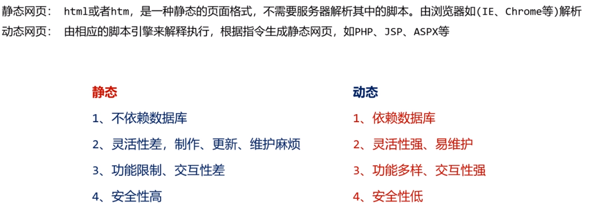
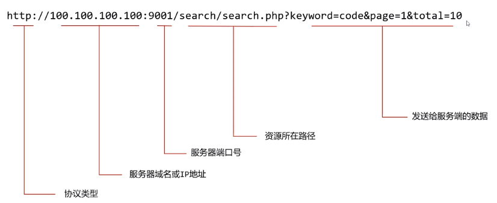
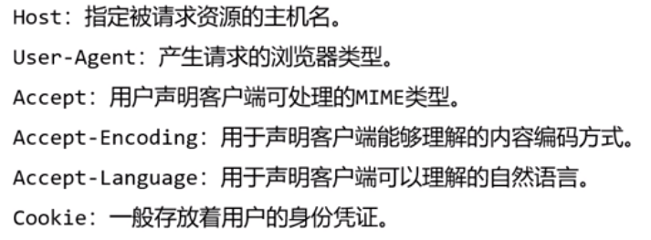
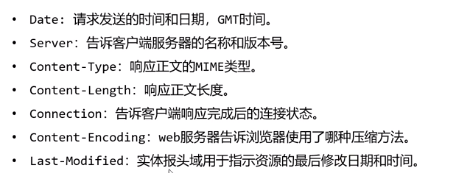
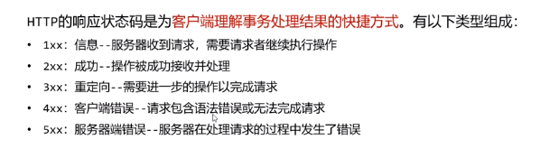

# 一. Web 应用介绍

互联网——第一个世界性的图书馆和第一个全球性网络论坛

如何提供信息？——

- 信息发布位置——公网
- 创建公网站点/软件，在站点/软件中写入公开信息
- 用胡通过浏览器/客户端访问该站点/应用，获取所需信息/服务

## 1.1 Web 应用

应用程序的两种模式

- C/S
- B/S ——web应用一般是B/S

一个Web应用由多个静态和动态资源组成——如html，css，js，jsp，php，java，支持的jar包和配置文件

## 1.2 Web应用基本架构

- 设计者
- Web应用服务器
- 动态脚本引擎
- 数据库

## 1.3 Web应用的访问

端口访问

- ftp——21
- ssh——22
- Web——80
- MySQL——3306
- .........

# 二. Web 应用安全

## 2.1 静态网页和动态网页的区别

# 三.Web 应用编码技术

确保能够安全处理不常见的字符和二进制数据。

## 3.1 URL编码

什么是url——统一资源定位符，俗称网页地址

标准格式——`protocol：//hostname[:port]/path/[?query]`

防止传输中的特殊字符混淆语法，将其用url编码方案进行编码

url编码——以`%`为前缀。其后是这个字符的2位十六进制ASCII代码。

## 3.2 Base64 编码

防止文件传输中的特殊字符影响传输

base64有很大可能在末尾留下一两个 `=`

### 3.3 Hex 编码

十六进制编码——防止文件乱码打不开。

# 四. HTTP协议剖析

http请求报文是承载命令的载体，当发现某Web应用具有命令执行漏洞时，往往会为后续入侵而让其执行更多的系统命令，达到信息收集、提权、植入后门等目的。大多数情况是将恶意代码放入http请求报文中。

什么是http？—— 超文本传输协议。它允许将HTML文档从web服务器传送到web浏览器

## 4.1 GET请求

在GET请求中，查询字符串（名称/值对）是在URL中发送的

URL是存在长度限制的，所以GET请求传递的数据是有限的

## 4.2 POST请求

在POST请求中，查询字符串（名称/值对）是在正文中发送的

POST可以请求大量数据

## 4.3请求头部

Referer ：用户从什么地方来的

## 4.4 HTTP响应报文

**响应头部**——描述服务器信息

**状态码**

## 4.5 HTTPS协议

在HTTP下加入了SSL/TLS层。 HTTPS通过安全传输机制进行传送数据。

# 五. 会话技术

由于http协议是无状态协议，Web应用需要不同请求和用户交换状态

为了实现这种功能，服务端生成一组在用户提交各种请求过程中代表状态的数据，通常保存在一个叫会话的服务端结构中，会话中包含了cookie与session

## 5.1 Session  && cookie

Session ——标识和跟踪用户。

Session保存在服务端，是唯一的用户标识

Cookie ——服务端通过Cookie识别特定的客户，每次Http请求时，客户端都会发送相应的Cookie信息到服务端。

大多数的应用都是用Cookie实现Session跟踪的，第一次创建Session的时候，服务端会在Http 协议中告诉客户端，需要在Cookie里面记录一个Session ID，以后，每次请求把这个ID发送至服务器，服务器即可识别

