# 前言

这是比较简单的xss练习小游戏，非常适合入门。一直以来，对xss的内容总感觉有一些屏障，应该是因为动手实践太少。所以，趁此机会，好好学习一番，打好基础，以后再继续深入。

### 关于xss

1.概念：XSS攻击全称[跨站脚本攻击](https://baike.baidu.com/item/跨站脚本攻击/8186208)（Cross-Site Scripting，XSS）是一种经常出现在 WEB 应用程序中的计算机安全漏洞。其是由于 WEB 应用程序对用户的输入过滤不足而产生的。攻击者利用网站漏洞把恶意的脚本代码注入到网页中，当其他用户浏览这些网页时，就会执行其中的恶意代码，对受害用户可能采取 Cookies 资料窃取、会话劫持、钓鱼欺骗等各种攻击。

2.分类：

- 反射型 XSS：攻击者通过特定手法（如电子邮件），诱使用户去访问一个包含恶意代码的 URL，当受害者点击这些专门设计的链接的时候，恶意代码会直接在受害者主机上的浏览器执行。通常出现在网站的搜索栏、用户登录口等地方，常用来窃取客户端 Cookies 或进行钓鱼欺骗。
- 持久型 XSS：也叫存储型跨站脚本，此类 XSS 不需要用户单击特定 URL 就能执行跨站脚本，攻击者事先将恶意代码上传或储存到漏洞服务器中，只要受害者浏览包含此恶意代码的页面就会执行恶意代码。一般出现在网站留言、评论、博客日志等交互处，恶意脚本存储到客户端或者服务端的数据库中。
- DOM XSS：DOM-Based XSS 是基于 DOM 文档对象模型的一种漏洞，受客户端浏览器的脚本代码所影响。

3.利用：

- Cookies 窃取 ：获取客户端的 Cookies 信息
- 会话劫持 ：接管现存的动态会话的过程
- 钓鱼 ：包括重定向钓鱼、HTML 注入式钓鱼、iframe 钓鱼、Flash 钓鱼等
- 网页挂马：一般都是通过篡改网页的方式来实现的，如在 XSS 中使用 `<iframe> `标签。
- DOS 与 DDOS：注入恶意 JavaScript 代码，可能会引起一些拒绝服务攻击。
- XSS 蠕虫 ：通过精心构造的 XSS 代码，可以实现非法转账、篡改信息、删除文章、自我复制等诸多功能。


# 实践

## 第一关

关键在于，要用一个合适的浏览器

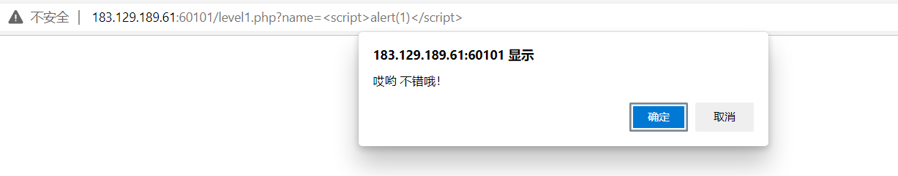

## 第二关

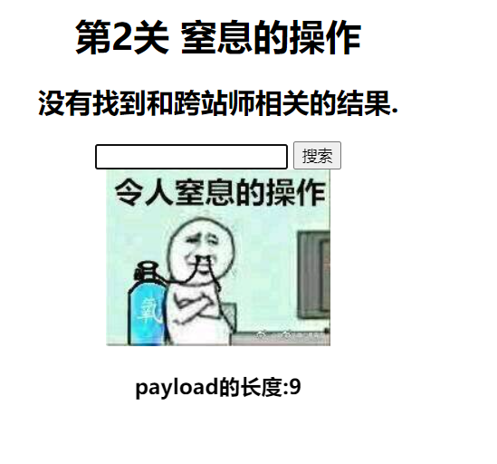

尝试xss，但是发现不行，看一下输入，发现是input的输入标签，那我们先闭合它，然后再alert


`"><script>alert(1)</script><"`

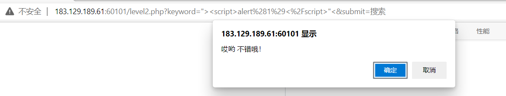


## 第三关

用上一关的payload发现，输入也被转义了

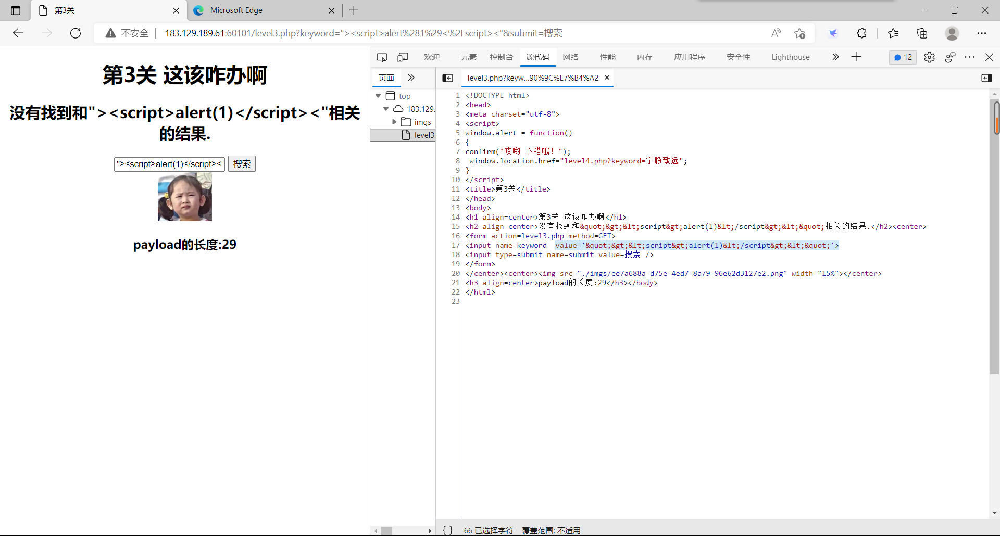

那就换一个方法

```javascript
onmouseenter='alert()' //当鼠标移动到就会触发
onclick='alert()' //鼠标点击时就会触发
onchange='alert()' //在域的内容改变时发生
oninput='alert()' //在用户输入时触发
onmouseover='alert()'//鼠标移动到就会触发
```


所以我们还可以这么写，要注意，现在它的闭合是单引号`'onclick='alert()`

需要点一下

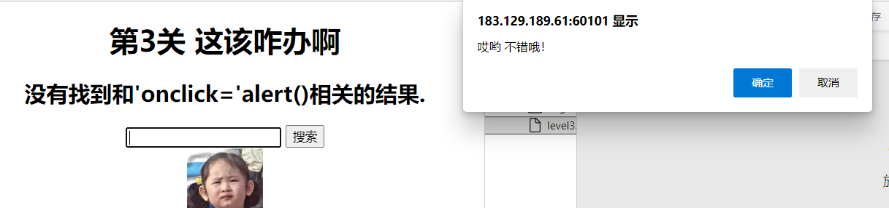


## 第四关

这就比较垃圾了，它把闭合改回了双引号

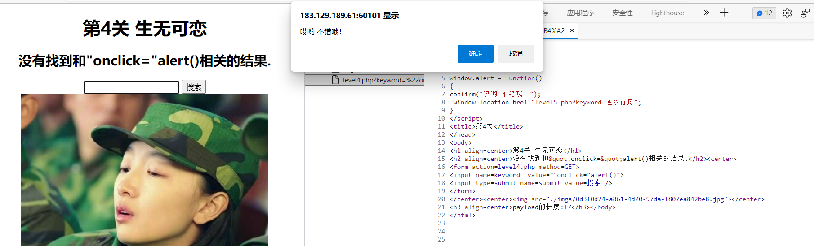


## 第五关

它把on全都转义了

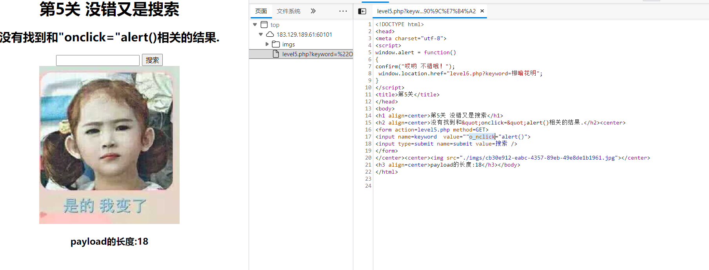

同时我们发现，它把script也转义了，但是<>的输入没有转义

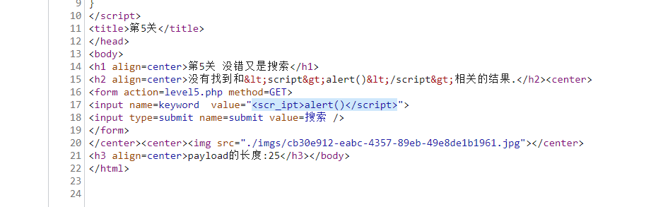

所以我们可以尝试一下`"><a href="javascript:alert('1')" >try</a><"`

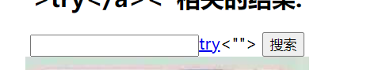

点击构造的超链接


## 第六关

在第五关的基础上，把href给转义了——>那就大写搞定

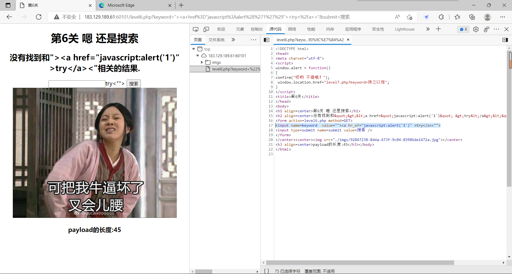


## 第七关

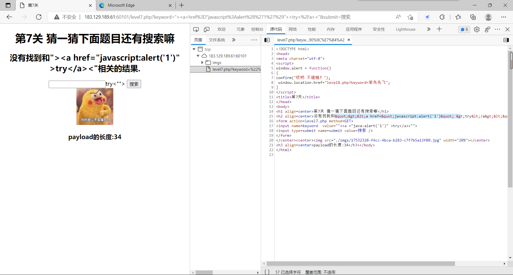

我们发现，它现在把`href`删了。用老方法试试呢？啊，双写绕过！

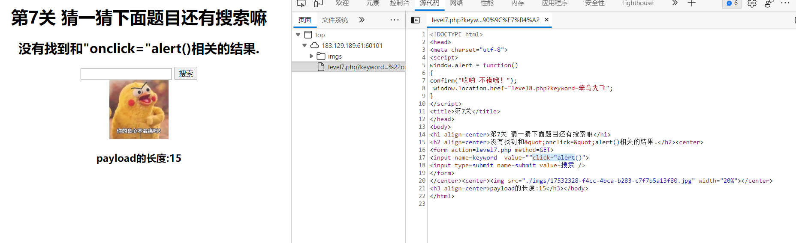

`"oonnclick="alert()`

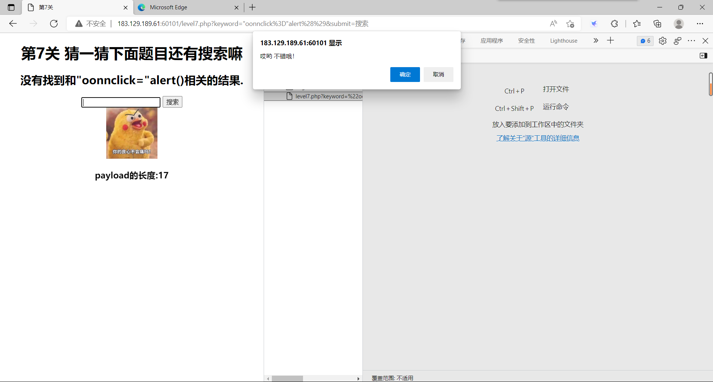

## **第八关**

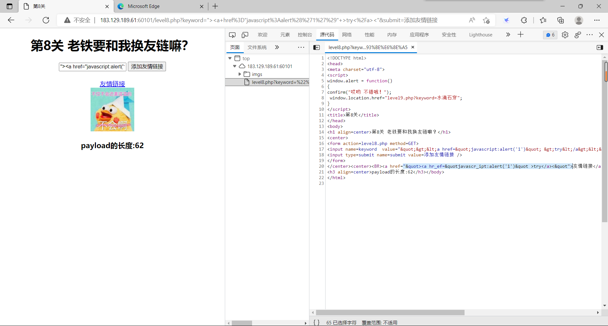

貌似会把填入的东西写入下面的a标签的href，并且会过滤掉`javascript`，同时也有好多过滤，那我们尝试转义字符，用Unicode编码把s变为`&#115;`

## 第九关

连接不合法

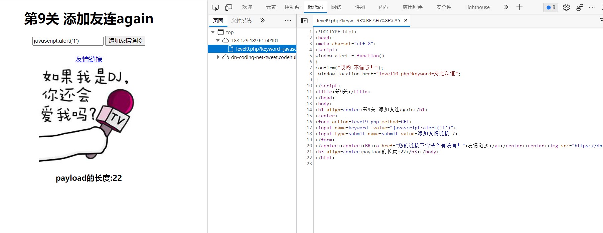

加上http或者https试一下,还要补全www.

发现script还要绕过一下


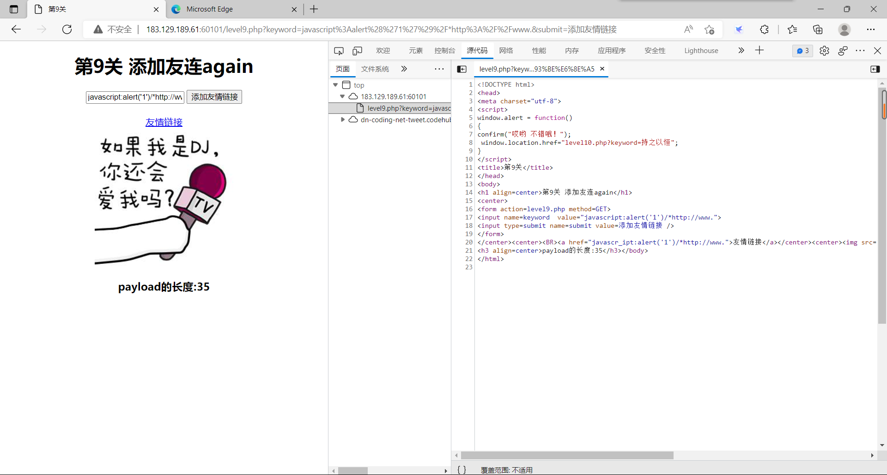


## 第十关

可以看到输出都被隐藏了

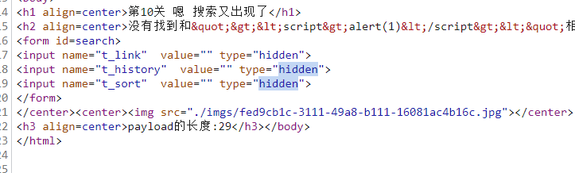

```javascript
keyword=<script>alert(1)</script>&t_link=<script>alert(1)</script>"type="txt"&t_history=<script>alert(1)</script>"type="txt"&t_sort=<script>alert(1)</script>"type="txt" 
```

我们把参数都试试，想办法放出来隐藏的输入

我们发现只有第三个参数的输入是有效的

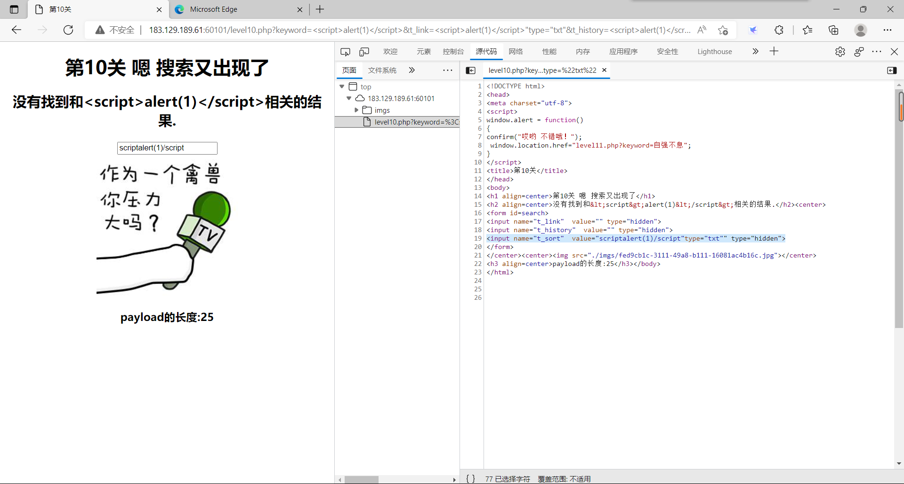

然后`"onclick="alert(1)"type="txt"`拿下


## 第十一关


和上一关一样的思路

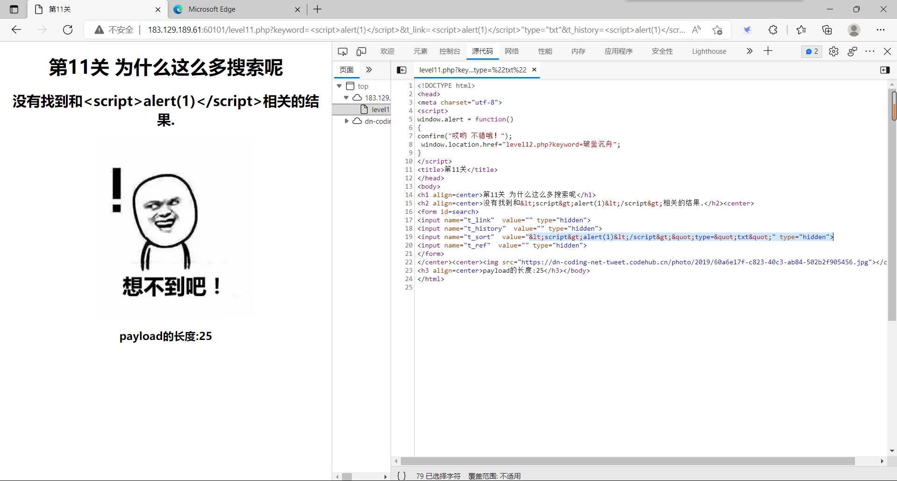

发现还是这个口，但是过滤了`<>，""`

没有头绪，先看源码吧：

```php
<h1 align=center>欢迎来到level11</h1>
<?php 
ini_set("display_errors", 0);
$str = $_GET["keyword"];
$str00 = $_GET["t_sort"];
$str11=$_SERVER['HTTP_REFERER'];
$str22=str_replace(">","",$str11);
$str33=str_replace("<","",$str22);
echo "<h2 align=center>没有找到和".htmlspecialchars($str)."相关的结果.</h2>".'<center>
<form id=search>
<input name="t_link"  value="'.'" type="hidden">
<input name="t_history"  value="'.'" type="hidden">
<input name="t_sort"  value="'.htmlspecialchars($str00).'" type="hidden">
<input name="t_ref"  value="'.$str33.'" type="hidden">
</form>
</center>';
?>
```

原来还有`$_SERVER['HTTP_REFERER']`，`t_sort`这里绕不过啊，转义了双引号，又不是单引号闭合。说明这题主要指向`$_SERVER['HTTP_REFERER']`

在php中，可以使用`$_SERVER[‘HTTP_REFERER’]`来获取`HTTP_REFERER`信息。关于`HTTP_REFERER`，php文档描述如下：

> 引导用户代理到当前页的前一页的地址（如果存在）。由 user agent 设置决定。并不是所有的用户代理都会设置该项，有的还提供了修改
> HTTP_REFERER 的功能。简言之，该值并不可信。

综上，此题我们需要在`HTTP_REFERER`上动手。由于规律和上一题一样，直接使用`"onclick="window.alert(1)"type="txt`存入Referer中，如图：

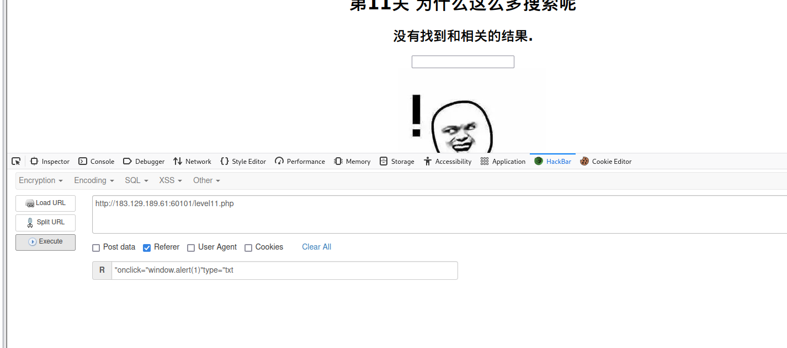

## 第十二题

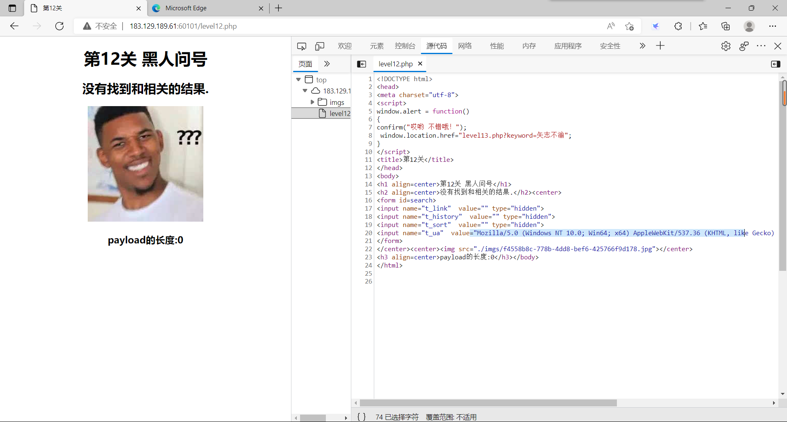

和上题一样，这回是user_agent

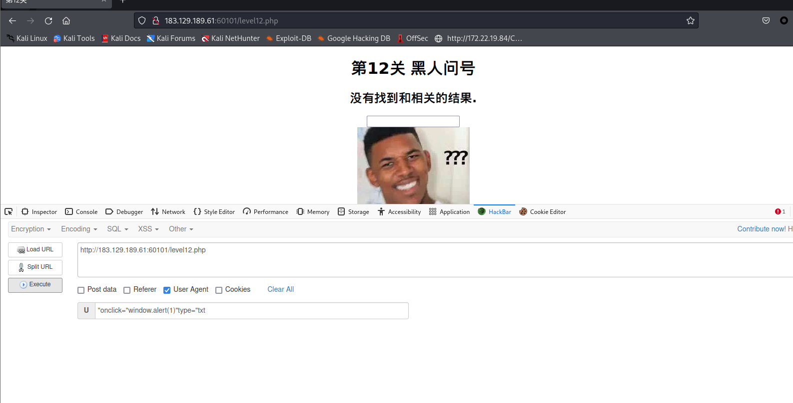


## 第十三题

1.直接先看解析，这次应该是Cookie，而且对应的内容为`call me maybe?`不知道对应那个参数。
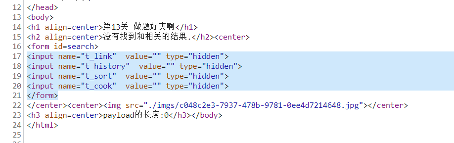

2.可以试一下，把所有 参数都进行传值，`keyword=aaa1"type="text&t_link=aaa2"type="text&t_history=aaa3"type="text&t_sort=aaa4"type="text&t_cook=aaa5"type="text`如图：
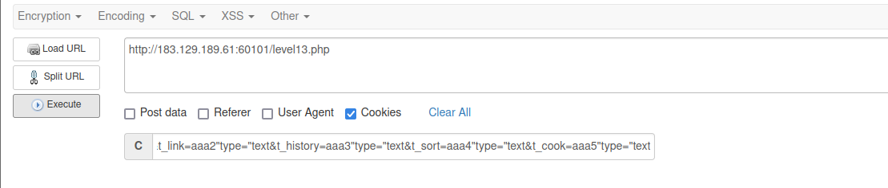

没有用，看来获取cookies的参数不是由以上任何参数获取。

3.没办法，用burpsuite抓包看看到底是何参数的：
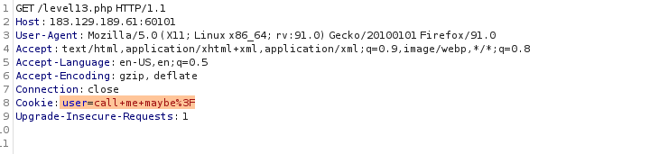

可以发现，是`user` 那我们直接在burpsuite中修改cookie吧：
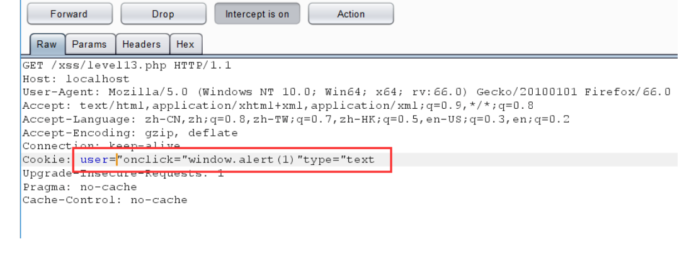

成功。
4.当然，也可以在火狐插件`HackBar`（上面用的就是此插件）的cookies处提交：`user="onclick="window.alert(1)"type="text` 
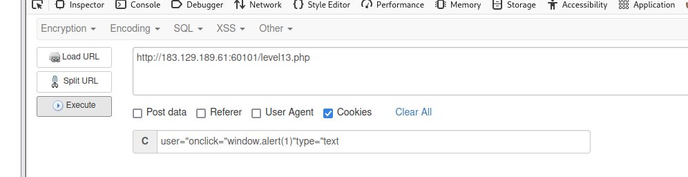