# 操作系统安全

## 1. 概述

主流操作系统：

- Windows 、 Linux 、MacOS 、Android、 IOS
- 常见漏洞：
  - 本地提权漏洞 低权限➡高权限
  - 远程代码执行

## 2. MetaSploit的使用

### 2.1 基本命令

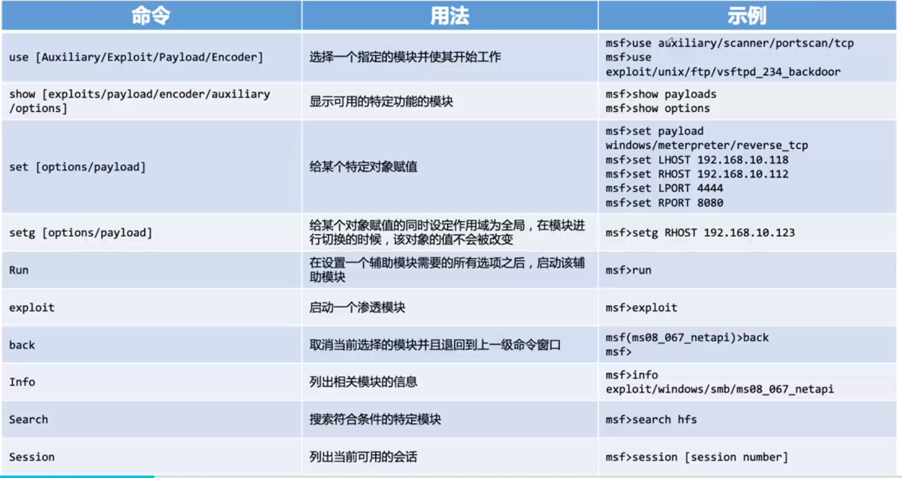

kali > `msfconsole`打开

之后使用模块

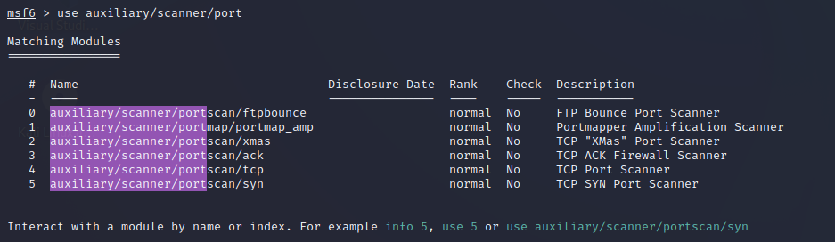

选择TCP扫描模块

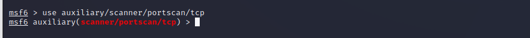

之后用`show option`查看设置项

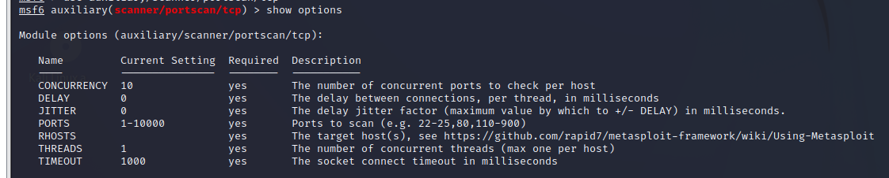

用`set`设置攻击目标，之后用`run`启动模块

然后用`exploit`启动渗透模块

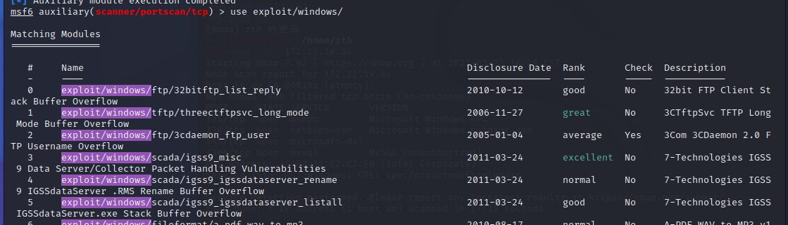

`back 返回上个窗口`

`info 列出信息`

### 2.2 MetSploit 工具

MetSploit 是一个使用内存技术的攻击载荷，可以注入到进程中。

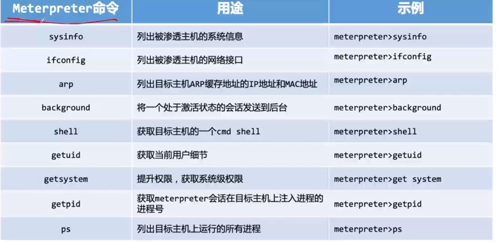

## 3. Windows 漏洞利用与防护

### 3.1 MS08-067（CVE-2008-4250）

- 是一个具有里程碑意义的 Windows SMB漏洞
- 是典型的Windows缓冲区溢出漏洞

记得复现！

首先更新一下kali的数据库

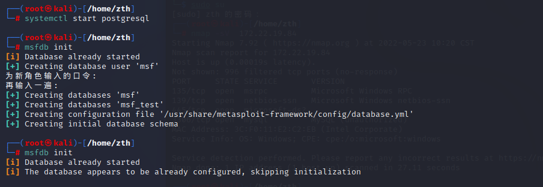

然后启动工具，使用端口扫描模块，查看需要设置的信息，然后选择攻击对象。

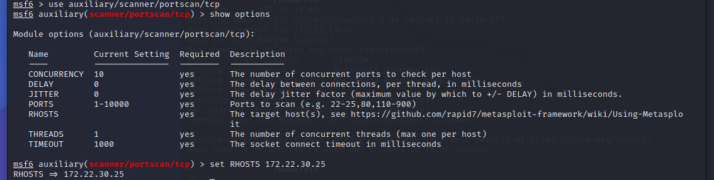

攻击对象是我的Windows XP虚拟机

run的时候需要关闭xp的防火墙，（奶奶滴！这也太逊了吧）我们可以看到它开启了445端口

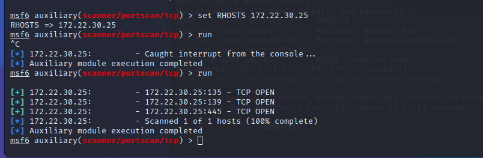

再用Nmap扫描获得一些信息

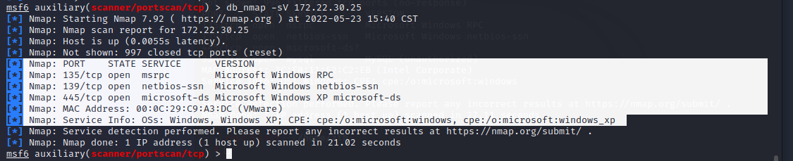

我们看到它是WindowsXP系统，那他就可能有ms08_067漏洞，那么用search查找一下，果然如此！

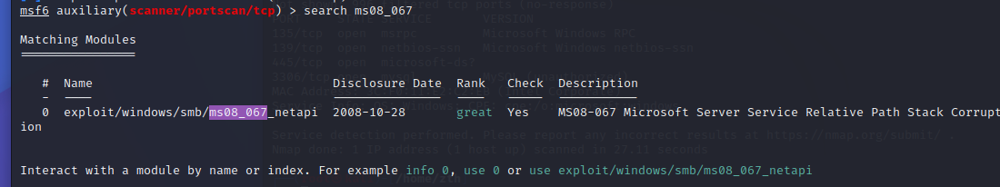

我们利用这个漏洞模块，他会自己给我们提供默认的payload ，然后查看一下设置项，发现需要一个攻击目标RHOSTS。

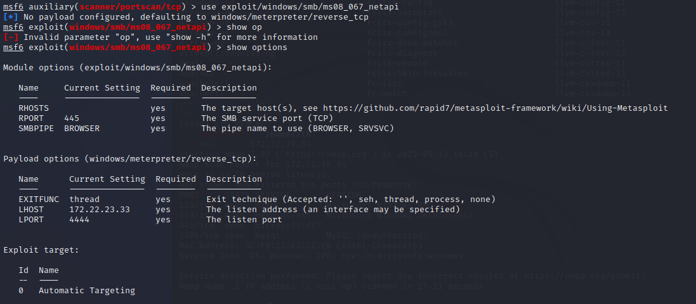

我们set一下攻击目标，也可以再手动set一下payload

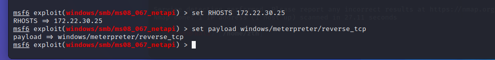

之后是一连串的失败！！！！

与视频讲的不太一样！我们需要手动set target！

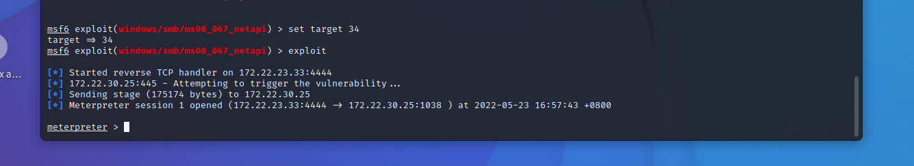

此外我们还需要在Windows上开启三个服务：

1. server
2. computer browser 
3. workstation

并且关闭防火墙和自动更新

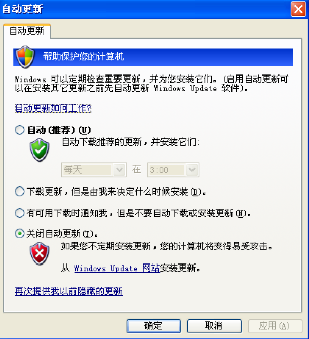

用sys info查看信息

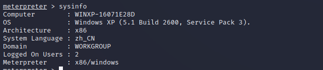

之后是拿到系统权限`getsystem`，然后打开控制台 `shell`，dir 查看当前目录

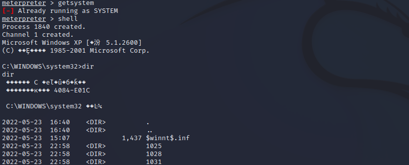

已经完全牛了这个windows xp！

### 3.2 MS17-010(永恒之蓝)

- Windows SMB
- Windows xp - Windows 2016

复现：

先用`search ms17_010`查找一下

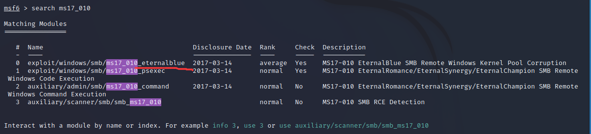

使用漏洞攻击

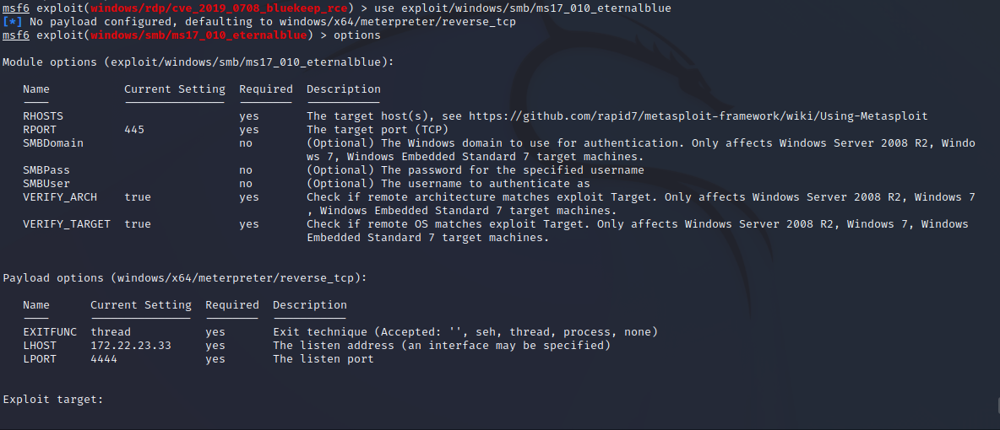

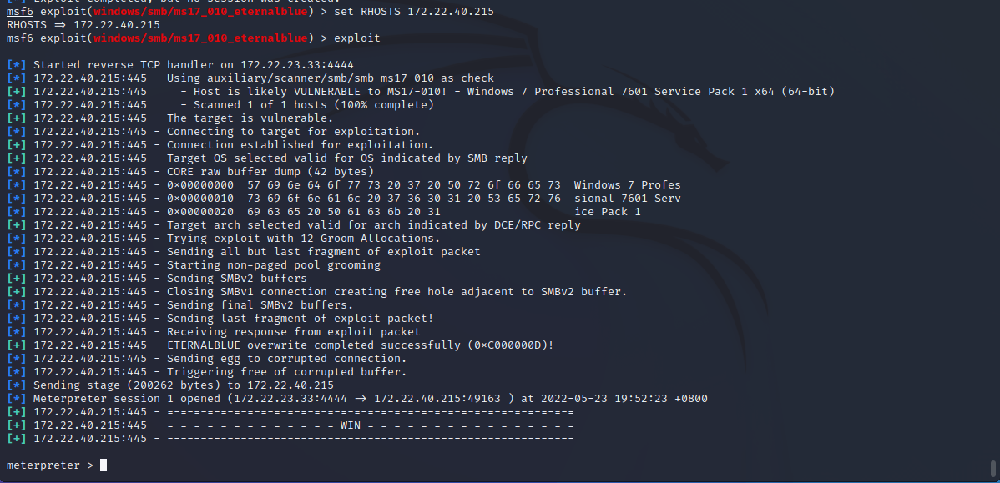

攻击成功之后拿shell

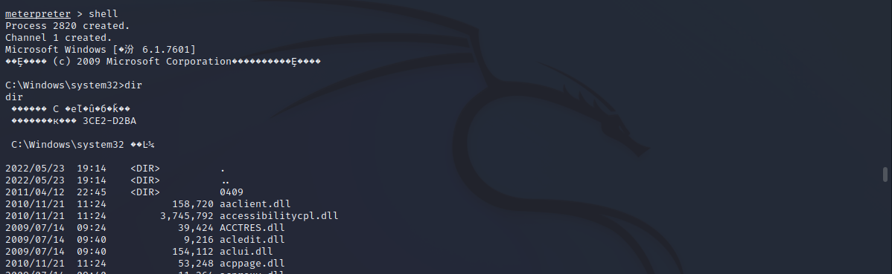

### 3.3 CVE-2019-0708 (BlueKeep)

- 通过远程桌面端口 3389 ，RDP协议进行攻击。

### 4. Linux 漏洞利用与防护

#### 4.1 CVE-2017-7494

Samba 远程代码执行漏洞

修复方式，升级Samba

没有2017版kali 回头复现

#### 4.2 CVE-2016-5195 （脏牛 Dirty COW）

漏洞危害：低权限用户利用该漏洞进行提权

**复现：**

首先拿到平台实验环境

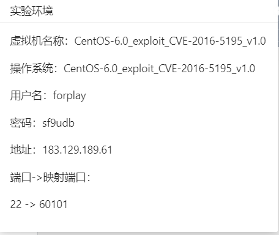

靶机连不上！明天再说

