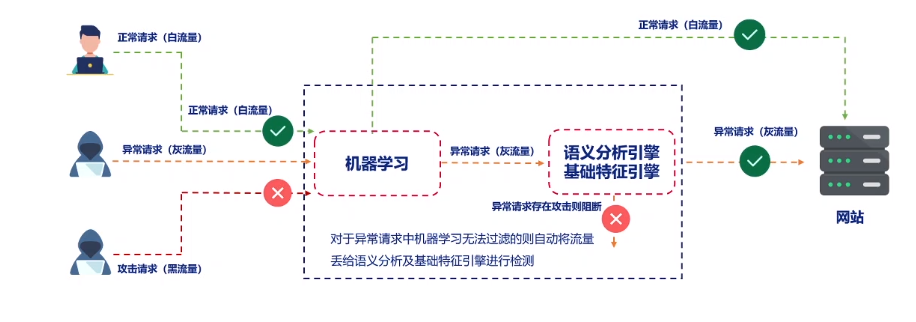

# 一、边界防护技术

## 1.简介

**国家安全案例**

- 震网事件
- 棱镜门事件

没有网络安全就没有国家安全 

网络边界防护——企业安全

在企业内进行网络区域划分，在关键地方设置防护（防火墙）

## 2.边界防护的安全概念

网络边界——具有不同安全级别的网络间的分界线

网络边界防护——针对不同网络环境设置的安全措施

企业网络常见边界

- 企业之间
- 重要部门与其他部门
- 总公司和分公司

**划分边界**

- 目的——实现大规模的复杂信息系统的安全防护
- 作用——分而治之

## 3. 边界防护的技术

- 安全域

  - 相同安全域共享相同安全策略
  - 以业务为中心、以流程为驱动、以风险为导向

- 访问控制

- 防火墙——隔离和访问控制

  - 基础组网和防护
  - 记录监管
  - 限定访问特殊站点
  - 限制风险范围
  - 网络地址转换
  - 虚拟专用网

- 网闸——不同时链接

- VPN——建立在公用网络的专用网络

  - 加密技术
  - 隧道技术

- SSL VPN

  - 保密
  - 鉴别
  - 完整性检验

  SSL VPN工作时主要使用的三种协议——握手协议、记录协议、报警协议

- IPSec VPN

  - 隧道模式——对整个IP数据包加密
  - 传输模式——只对有效数据部分进行加密

- 抗拒绝服务——放在最前端

  - 阈值限制
  - 验证识别
  - 端口保护
  - 规则匹配

# 二、下一代防火墙

## 1. 接口类型

**类型：**

- 物理接口——硬件接口
- 子接口 ——以太网子接口、聚合子接口
- 网桥接口——负责数据链路层的报文转发
- 聚合接口——物理接口的集合
- 隧道接口——报文封装和解封装
- 无线接口
- 回环接口

### 

## 2. 产品功能介绍——安全策略

### 2.1 安全策略基础

**基本元素**：

- 流量类型
- 流量的安全域
- 源地址与目的安全域
- 目的地址
- 行为

**安全策略匹配原则**——根据流量控制条件，顺序匹配

# 三、WAF

背景——web网站信息泄露严重，存在隐患。黑客进入门槛越来越低，网站运维和管理人员安全意识淡薄。

## 1.  产品概述

明御WEB应用防火墙

- 双引擎工作模式
- 有效防御OWAP TOP10攻击行为
- 结合深度学习智能识别已知恶意请求和防御未知威胁

## 2.  常见部署方式介绍

| 部署方式       | 部署特点                                                     |
| -------------- | ------------------------------------------------------------ |
| 透明代理部署   | 不需要改变用户的网络结构；对用户透明的；安全防护能力强；故障恢复快，可支持Bypass； |
| 桥模式部署     | 真正意义上的纯透明；不对数据包做任何更改；                   |
| 反向代理——代理 | 可旁路部署；对于用户不透明；防护能力强；故障恢复时间慢，恢复时需要重新将域名或地址映射到原服务器。用于复杂环境中；支持VRRP设备 |
| 反向代理——迁移 | 同上，恢复时需要删除策略路由配置                             |
| 旁路监控模式   | 再交换机做服务器端口镜像，将流量复制一份到WAF上；只会警告而不阻断。 |
| 透明代理HA     | 双机HA，一台WAF处于检测防护模式，另一台备用模式。            |
| 反向代理VRRP   | 主备                                                         |

## 3. 产品功能及特性

**机器学习**

WAF对HTTP访问流量进行学习

**威胁情报**——实时获取威胁情报信息，并应用威胁情报进行威胁检测。

**访问审计**

**HTTPS站点保护**——HTTPS传输过程中加密，WAF无法直接访问内容，需要启用该功能并上传公钥私钥和证书链才能实现对HTTPS加密报文的检测

**可靠性保障**

**支持多种告警方式以及丰富多样的报表**

**规则库支持在线升级**

**云端威胁情报实时联动**

**本地DDOS防护**

**本地HTTPS加速卡**

**支持IPV4和IPV6**

**地图态势分析**

**一键完成规则调整**

**内置敏感信息库**

# 四、综合日志审计 SOC

