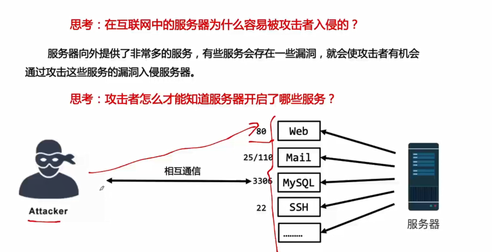
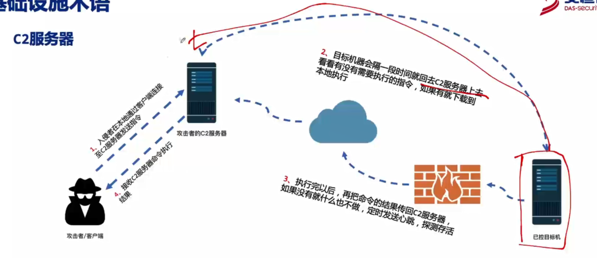
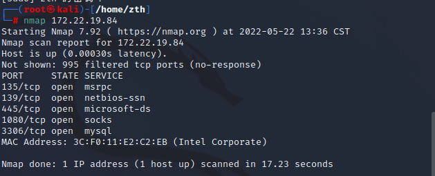
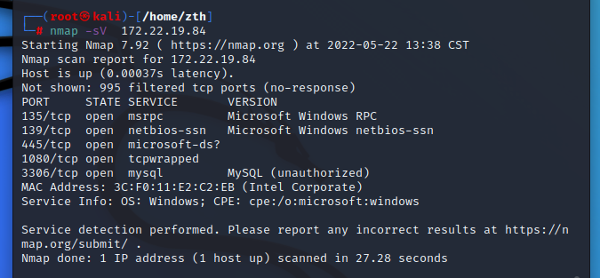
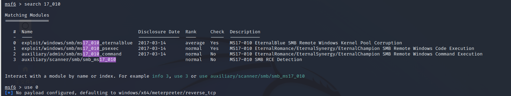
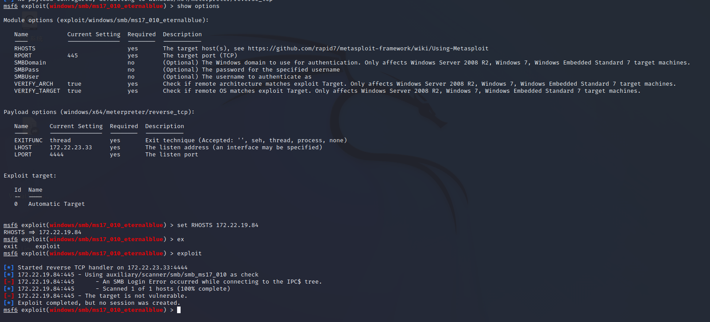

# 网络安全攻防基础


## 1.入侵原理介绍

互联网中的服务器为什么会被入侵？————服务存在漏洞

如何知道服务器开启哪些服务？————端口



SSH暴力破解

通过端口扫描探测服务器开启哪些服务，之后利用漏洞攻击。

其他方式——种植木马，缓冲区溢出。

## 2.安全术语

### 2.1 漏洞利用术语 

POC（proof of concept）：概念验证，用于验证安全漏洞是否存在，能否被利用

EXP （Exploit）：漏洞利用，——一段有利用价值的攻击代码，或者一个利用过程

Payload： 攻击载荷，EXP 拿下目标后，在目标机器上执行的定制代码或程序。

### 2.2 安全漏洞生命周期

发现——公布 ——官方补丁

- 0day：未公布，exp通杀
- 1day：公布之后，未修复，可以用exp入侵大部分系统
- Nday：已有补丁，可以用exp入侵未修复的系统

### 2.3 CVE/CNVD

CVE ：通用漏洞纰漏

CNVD：国家信息安全漏洞共享平台

### 2.4 Shell / WebShell

- shell ：一个应用程序，连接用户和Linux内核，高效安全低成本。
- WebShell：是以asp、php、jsp或者cgi等网页文件形式存在的一种代码执行环境，用于网站管理，服务器管理，权限管理的操作。

### 2.5 C2服务器

- C2服务器 command and control server，中文为命令和控制服务器

 

### 2.6 内网/外网/DMZ区

内网：局域网

DMZ区：隔离区，非军事化区，对外服务区。

### 2.7 代理

代理通常用于身份隐藏，端口转发

身份隐藏：攻击者通过第三方代理服务器访问目标系统，从而隐藏自己真实IP

端口转发：可以通过代理软件穿透内网限制，访问核心内网服务器

### 2.8 攻击面术语

- 互联网链路攻击
- 社会工程攻击（鱼叉，鲸钓，水坑）
- 近源攻击（USB ，WIFI，门禁）
- 供应链攻击（合作伙伴，供应商）

### 2.9 攻击活动术语

APT攻击：高级持续性威胁，针对特定目标进行的手段高超、低调隐蔽、时间持久、精心策划的攻击

渗透测试： 是指受信任第三方通过模拟黑客的攻击技术与手段对目标网络、系统进行攻击测试。发现安全隐患，给出建议和评估方法。

### 2.10 攻击手段术语

- 拖库：将数据库拖出到本地
- 洗库：洗出有价值账号
- 撞库：将数据库做成字典表，撞其他的网站。
- DOS攻击：利用网络协议缺陷
- DDOS攻击：控制傀儡机组成攻击群 
  - 带宽消耗
  - 资源消耗
- 中间人攻击：基于ARP DNS HTTP SSL等协议发起劫持攻击

### 2.11 社会工程学

利用人的贪婪和好奇

- 钓鱼攻击：通过高仿网站，欺诈邮件，虚假短信

## 3.安全工具

- 信息收集（爱企查、Google、shodan、nmap）
- 漏洞扫描（AWVS、Nessus）
- 渗透攻击（Hydra、Metasploit）
- 后渗透攻击（Metasploit）
- kali Linux

### 3.1 IT资产信息收集工具

#### 3.1.1 Google

查找网站子域名，网站后台，泄露文件、文档

`site:baidu.com` 返回所有和这个站有关的

`intitle:"后台登录" `返回指定的title有关的url 

`filetype:bak `搜索指定文件类型如.bak ,.mdb,.inc等

`intext:  ` `intext:username and password`

`inurl: ` `inurl: upload.php`搜索指定的字符是否存在url中

#### 3.1.2 Shodan

可以搜索连接到互联网的设备的工具。找到有关的路由器，交换机，服务器，IoT设备等资产的信息。

```
hostname:		搜索指定主机的域名
port:			搜索指定端口或服务
country:		搜索指定国家
city:			搜索指定城市
org:			搜索指定组织或公司
isp:			搜索指定ISP供应商
product:		搜索指定操作系统/软件/平台
version:		搜索指定软件版本
geo:			搜索指定的地理位置
before/after:	搜索指定收录时间前后的数据
net:			搜索指定的IP地址或子网
```

#### 3.1.3 Namp

主机探测、服务/版本检测，操作系统探测，网络路由跟踪

基本扫描



-sV（版本探测）



### 3.2 漏洞扫描

#### 3.2.1 Web站点扫描——AWVS

选择扫描目标站点可能存在的漏洞，寻找存在攻击的入口

#### 3.2.2 主机漏洞扫描——Nessus

涵盖内容：网络设备扫描，虚拟主机漏洞扫描，操作系统漏洞扫描，数据库漏洞扫描，web漏洞扫描等

#### 3.2.3 暴力破解工具——Hydra

#### 3.2.4 攻击框架 ——Metasploit

基本模块：

1. Auxiliary（辅助模块）
2. Exploits（攻击模块）
3. Payload（攻击载荷模块）
4. Post（后渗透模块）
5. Encoders（编码模块）






不过我的主机相对安全，没有攻击成功。看来想进入还得找专业的鸡。

